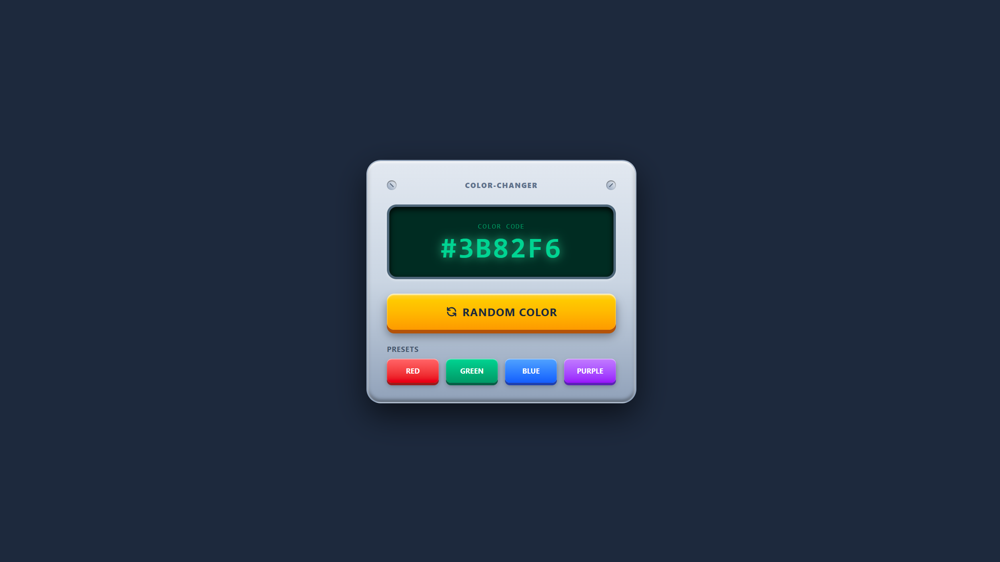

# 🎨 Color Changer

**Created:** August 13, 2026  
**Last Updated:** August 14, 2026

🔗 **Live Demo:** [Click Here 👆](https://color-changer-orpin.vercel.app/)

An aesthetic, real-time color changer crafted with **HTML**, **Tailwind CSS**, and **Vanilla JavaScript**. Designed around modern **Skeuomorphic UI** principles, the interface provides a satisfying, touchable experience with realistic textures, custom interactive button press states, intuitive color palette logic, and fluid fade transitions.

---



---

## Features

- 🎨 **Pure Skeuomorphic UI Design:** A highly tactile, realistic 3D interface replicating vintage hardware, complete with mechanical screws, a recessed digital screen, and deep spatial depth.
- 🎲 **Dynamic Hex Color Generator:** Instantly calculates and projects randomized 6-digit HEX codes onto the faux-LCD display panel.
- 🎛️ **Mechanical Preset Switches:** Dedicated quick-action preset buttons to snap the display instantly to classic hardware channels (Red, Green, Blue, Purple).
- 🖱️ **Realistic Button Depressing:** Implements precise CSS `:active` physics, causing tactile buttons to physically shift downward and compress shadows upon clicking.
- 📱 **Fully Responsive Core:** Perfectly scaled, centered component grid that maintains its rigid hardware proportions fluidly across modern mobile and desktop screens.
- ⚡ **Zero-Dependency Engine:** High-performance rendering built strictly on native vanilla JavaScript, semantic HTML5, and utility-first Tailwind CSS classes.

---

## Tech Stack

| Technology           | Purpose                         |
| -------------------- | ------------------------------- |
| HTML5                | Page structure                  |
| Tailwind CSS         | Styling and layout              |
| JavaScript (Vanilla) | Counter logic and interactivity |

---

## Project Structure

```text
color-changer/
├── 📁 assets/               # Static assets
│   └── 📁 images/           # Images and icons
│       └── 📄 favicon.png   # Favicons on website
│       └── 📄 preview.png   # Project preview screenshot
├── 📁 node_modules/         # Dependencies managed by npm
├── 📁 src/                  # Application source logic
│   └── 📄 main.js           # JavaScript clock logic
│   └── 📄 style.css         # Tailwind CSS import
├── 📄 README.md             # Project documentation
├── 📄 index.html            # Entry HTML page
├── 📄 package-lock.json     # Locked npm package versions
├── 📄 package.json          # Node project metadata and scripts
└── 📄 vite.config.ts        # Vite bundler configuration
```

---

## How It Works

1. **Color Selection Logic:** When the **"Random Color"** button is clicked, a JavaScript engine uses a pool of hex characters (`0-9` and `A-F`) combined with `Math.random()` to dynamically compile a valid 6-digit hexadecimal color code.
2. **Preset Channeling:** When any of the physical preset switches (Red, Green, Blue, Purple) are triggered, the script bypasses the randomizer and immediately grabs the hardcoded color data from the button's custom HTML attribute.
3. **DOM & CSS Refreshes:** The script instantly pushes the updated hex string into the target screen element (`#colorDisplay`) via `.innerText`, while simultaneously updating the text color style to match the exact generated hex value.

---

## Customization

- 🎛️ **Expand Presets:** Open the HTML structure and simply copy an existing `<button>` inside the presets grid, changing the `data-color` attribute and background color to add your custom color options.
- 🎨 **Adjust Skeuomorphic Shadows:** Modify the custom CSS classes (`.skeu-card`, `.skeu-screen`, `.skeu-btn-orange`) in the `<style>` block to experiment with deeper drop-shadows or different light source angles.
- 📐 **Resize Hardware Shell:** Tweak the width (`w-[380px]`) and padding (`p-6`) utility classes on the main container element to easily scale the color changer card dimensions for your layout.

---

<div align="center">

_"Every great app starts with someone brave enough to click `+` first."_

⭐ **If this counter counted anything for you, give the repo a star!** ⭐

</div>
